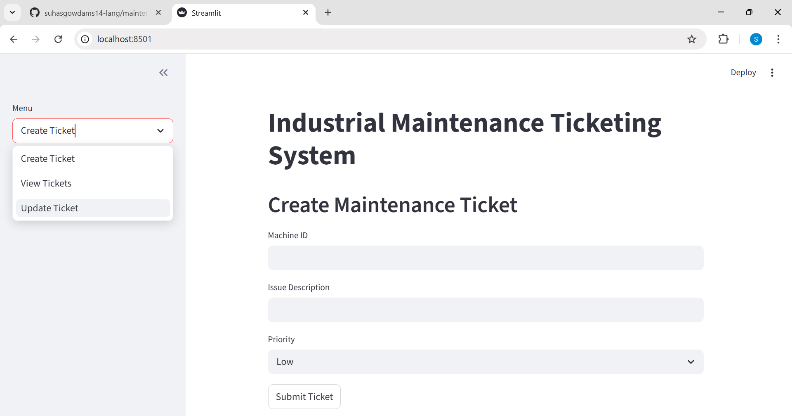

# Industrial Maintenance Ticketing System

A simple maintenance management system that allows technicians to create, track, and update machine maintenance tickets through an interactive dashboard.

## Features
- Create maintenance tickets
- Track machine issues
- Update repair status
- View maintenance analytics
- High priority alerts

## Tech Stack
- Python
- SQLite
- Streamlit
- Pandas

## System Architecture
User → Streamlit Dashboard → Python Backend → SQLite Database

## Use Case
This system simulates how maintenance issues are tracked in industrial environments to improve operational visibility and reduce machine downtime.

## Dashboard Preview

